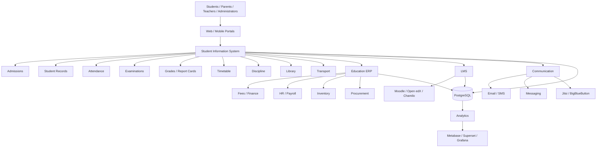
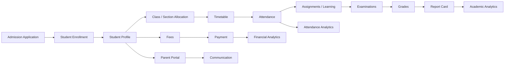

# Awesome-School-Management

## Top School Management Systems Ecosystem

**Curated List of SaaS/Hosted Platforms & Open-Source GitHub Projects**
*Focused on Student Information Systems, School ERP, Academic Management, Attendance, Fees, Exams, Timetables, Parent Portals & Administration*
**Last updated: September 2026**

This repository tracks notable **SaaS/Hosted platforms** and **open-source projects** for **School Management Systems (SMS), Student Information Systems (SIS), School ERP and Education Management Platforms**. These systems manage student records, admissions, attendance, examinations, grades, fees, timetables, communication, transportation, libraries, staff, parents and broader school administration.

**Examples** include Teachmint, Fedena, PowerSchool, Gradelink, Classter, Alma SIS, MyClassCampus, OpenEduCat, FACTS SIS and QuickSchools.

**Open-source emphasis**: This section is heavily expanded with open-source school-management and SIS projects for self-hosting, customization, data ownership and integration. Particularly notable projects include **OpenEduCat, Gibbon, RosarioSIS, Fedena, AlekSIS, Frappe Education, OpenSIS and SchoolTool**, although their current maintenance status and licensing models differ. A 2026 review of self-hosted school-management systems highlights Gibbon, OpenEduCat, Frappe Education, AlekSIS and RosarioSIS among the major open-source options. ([RosarioSIS][1])

Open-source school software is not a single homogeneous category: some projects are complete SIS platforms, others are educational ERPs, LMSs, or frameworks that can be combined into a complete school-management environment.

Contributions welcome! Open a PR to add/update entries. Keep descriptions factual and link to official sites or GitHub repositories.

## Table of Contents

* [SaaS/Hosted Platforms](#saashosted-platforms)
* [Open-Source GitHub Projects](#open-source-github-projects)
* [Open-Source School Management Platforms](#open-source-school-management-platforms)
* [Open-Source Student Information Systems](#open-source-student-information-systems)
* [Open-Source Education ERP Platforms](#open-source-education-erp-platforms)
* [Open-Source LMS & Learning Platforms](#open-source-lms--learning-platforms)
* [Open-Source Communication & Collaboration](#open-source-communication--collaboration)
* [Open-Source Analytics & Reporting](#open-source-analytics--reporting)
* [Additional Strong Open-Source Options](#additional-strong-open-source-options)
* [Commercial School Management → Open-Source Equivalents](#commercial-school-management--open-source-equivalents)
* [Frameworks for Building Custom School Management Systems](#frameworks-for-building-custom-school-management-systems)
* [Reference School Management Architecture](#reference-school-management-architecture)
* [Typical School Management Workflow](#typical-school-management-workflow)
* [Open-Source Capability Matrix](#open-source-capability-matrix)
* [How to Contribute](#how-to-contribute)
* [Disclaimer](#disclaimer)

## SaaS/Hosted Platforms

* **[Teachmint](https://www.teachmint.com/)**
  Education-management and digital-classroom platform providing school administration, learning, communication, assessment and teacher-focused tools.

* **[Fedena](https://fedena.com/)**
  School ERP/SIS platform covering student management, academics, attendance, examinations, fees, communication, HR and administration.

* **[PowerSchool](https://www.powerschool.com/)**
  Large-scale K-12 education technology ecosystem covering SIS, learning, assessment, analytics, communication and school/district administration.

* **[Gradelink](https://www.gradelink.com/)**
  Cloud-based student information and school-management system covering enrollment, attendance, grading, report cards, communication and administration.

* **[Classter](https://www.classter.com/)**
  Comprehensive school and higher-education management platform combining SIS, LMS, admissions, finance, CRM, scheduling and communication.

* **[Alma SIS](https://www.getalma.com/)**
  K-12 student information system providing student records, grading, attendance, scheduling, reporting, communication and family-facing functionality.

* **[MyClassCampus](https://www.myclasscampus.com/)**
  School ERP and campus-management platform with modules for students, attendance, fees, examinations, communication, transport and administration.

* **[OpenEduCat](https://openeducat.org/)**
  Open-source education ERP with both community/self-hosted and commercial offerings, covering admissions, students, attendance, examinations, fees, library, timetable and parent communication. The Community Edition is LGPLv3. ([GitHub][2])

* **[FACTS SIS](https://www.factsmgt.com/)**
  School information-management platform covering student records, enrollment, academics, attendance, communication and administrative workflows.

* **[QuickSchools](https://www.quickschools.com/)**
  Cloud-based school management/SIS platform covering student records, attendance, gradebook, report cards, scheduling, communication and administration.

* **[Blackbaud Education Management](https://www.blackbaud.com/solutions/education-management)**
  Education-management suite covering student information, enrollment, learning, advancement and school administration.

* **[Veracross](https://www.veracross.com/)**
  Independent-school management platform combining SIS, admissions, advancement, billing, scheduling, communication and school operations.

* **[Finalsite](https://www.finalsite.com/)**
  Education platform combining school websites, communications, enrollment and digital engagement.

* **[Gradelink SIS](https://www.gradelink.com/)**
  Integrated SIS and school administration platform emphasizing grading, attendance, report cards and parent communication.

* **[Skyward](https://www.skyward.com/)**
  K-12 student information and school-management ecosystem covering administration, academics, finance, HR and family engagement.

* **[Infinite Campus](https://www.infinitecampus.com/)**
  K-12 SIS platform supporting student records, attendance, grades, scheduling, communication, analytics and district administration.

* **[Aeries](https://www.aeries.com/)**
  K-12 student information system supporting enrollment, attendance, grading, scheduling, reporting, parent/student portals and analytics.

## Open-Source GitHub Projects

* **[OpenEduCat](https://github.com/openeducat/openeducat_erp)**
  Comprehensive open-source educational ERP built on Odoo, covering admissions, student information, courses, attendance, examinations, fees, library, hostel, timetable, assignments and parent functionality. The repository states that OpenEduCat Community Edition is LGPL-3.0 licensed. ([GitHub][2])

* **[Gibbon](https://github.com/GibbonEdu/core)**
  Flexible open-source school-management platform for teachers, students, parents and school leaders. It provides modules for students, attendance, timetable, assessment, activities, staff, finance, messaging and administration. Gibbon is GPLv3 licensed. ([GitHub][3])

* **[RosarioSIS](https://github.com/francoisjacquet/rosariosis)**
  Open-source student information system covering student records, attendance, grading, scheduling, billing, reporting, discipline and administrative functions. It is GPLv2 licensed. ([GitHub][4])

* **[Fedena](https://github.com/projectfedena/fedena)**
  Open-source school-management/SIS application built with Ruby on Rails. The repository describes it as an open-source school management system and identifies Apache License 2.0. ([GitHub][5])

* **[AlekSIS](https://github.com/AlekSIS/AlekSIS)**
  Open-source school-information system designed for managing school data, people, classes, lessons, attendance and related administrative workflows.

* **[Frappe Education](https://github.com/frappe/education)**
  Education-management application built on the Frappe framework, providing student, program, course, assessment and academic-management functionality.

* **[OpenSIS](https://github.com/opensis/opensis-classic)**
  Open-source student information system oriented toward school administration, student records, scheduling, attendance, grading and reporting.

* **[SchoolTool](https://launchpad.net/schooltool)**
  Historically important open-source school-management/SIS project providing student records, schedules, attendance, gradebooks and school administration. Its current development status should be carefully evaluated before new deployment.

### Additional Strong Open-Source Options

* **[OpenEduCat](https://github.com/openeducat/openeducat_erp)** — education ERP/SIS.
* **[Gibbon](https://github.com/GibbonEdu/core)** — school-management platform.
* **[RosarioSIS](https://github.com/francoisjacquet/rosariosis)** — student information system.
* **[Fedena](https://github.com/projectfedena/fedena)** — open-source school ERP/SIS.
* **[AlekSIS](https://github.com/AlekSIS/AlekSIS)** — school information system.
* **[Frappe Education](https://github.com/frappe/education)** — education-management application.
* **[OpenSIS Classic](https://github.com/opensis/opensis-classic)** — open-source SIS.
* **[SchoolTool](https://launchpad.net/schooltool)** — legacy open-source SIS.
* **[Moodle](https://github.com/moodle/moodle)** — open-source LMS.
* **[Chamilo LMS](https://github.com/chamilo/chamilo-lms)** — open-source learning platform.
* **[Open edX](https://github.com/openedx/edx-platform)** — large-scale open-source learning platform.
* **[BigBlueButton](https://github.com/bigbluebutton/bigbluebutton)** — open-source virtual classroom.
* **[Jitsi Meet](https://github.com/jitsi/jitsi-meet)** — open-source video-conferencing platform.
* **[Nextcloud](https://github.com/nextcloud/server)** — self-hosted collaboration and file platform.
* **[Mattermost](https://github.com/mattermost/mattermost)** — open-source collaboration/messaging platform.

## Open-Source School Management Platforms

### OpenEduCat

**[OpenEduCat](https://github.com/openeducat/openeducat_erp)** is one of the strongest open-source candidates for a comprehensive school-management platform.

The Community Edition includes functionality around:

* Student information
* Faculty management
* Admissions
* Courses
* Batches
* Attendance
* Examinations
* Fees
* Library
* Hostel
* Timetable
* Assignments
* Classroom
* Activities
* Parent communication
* Facilities

The repository describes it as an open-source educational ERP, while the official project currently identifies the Community Edition as LGPLv3 and self-hostable. ([GitHub][2])

Its Odoo foundation also makes it particularly interesting for institutions wanting to integrate education with broader ERP functions.

### Gibbon

**[Gibbon](https://github.com/GibbonEdu/core)** is one of the strongest open-source choices for schools that want a purpose-built school-management system rather than a general ERP.

Its modules include:

* Students
* Admissions
* Attendance
* Timetable
* Markbook
* Assessments
* Behaviour
* Staff
* Activities
* Library
* Finance
* Messaging
* Administration

The project is GPLv3 licensed and actively maintained. ([GitHub][3])

### RosarioSIS

**[RosarioSIS](https://github.com/francoisjacquet/rosariosis)** is a full-featured open-source SIS with particular emphasis on school administration.

Features include:

* Student records
* Enrollment
* Attendance
* Gradebook
* Scheduling
* Discipline
* Student billing
* Staff management
* Reports
* Parent/student information
* Plugins
* Moodle integration

The project is GPLv2 licensed. ([GitHub][4])

### Fedena

**[Fedena](https://github.com/projectfedena/fedena)** is a historically important open-source school-management system built using Ruby on Rails.

The repository describes it as an open-source school management system and identifies Apache License 2.0. ([GitHub][5])

It can be useful for:

* Student management
* Campus records
* Staff
* Courses
* Attendance
* Examinations
* School administration

However, its current development activity and ecosystem should be evaluated carefully before choosing it for a new production deployment.

## Open-Source Student Information Systems

### AlekSIS

**[AlekSIS](https://github.com/AlekSIS/AlekSIS)** is designed as a modern open-source school-information system.

Potential areas include:

* Student records
* Classes
* Courses
* Lessons
* Attendance
* Timetables
* School administration
* User management

It is particularly interesting for institutions wanting a modular Python/Django-oriented architecture.

### OpenSIS

**[OpenSIS](https://github.com/opensis/opensis-classic)** is oriented specifically toward student-information management.

Typical SIS functions include:

* Student demographics
* Enrollment
* Attendance
* Scheduling
* Grades
* Report cards
* Student records
* Administrative reporting

It is more directly an SIS than a complete school ERP.

### RosarioSIS

RosarioSIS remains one of the strongest open-source choices when the requirement is specifically **student information management** rather than a broad education ERP. Its GitHub repository describes a web-based SIS with student, teacher, parent and administrative functionality plus billing and extensibility. ([GitHub][4])

## Open-Source Education ERP Platforms

### Frappe Education

**[Frappe Education](https://github.com/frappe/education)** extends the Frappe/ERPNext ecosystem into education.

It can provide:

* Student management
* Programs
* Courses
* Student groups
* Assessments
* Academic structures
* Fee management
* Education workflows

This makes it particularly attractive for organizations wanting **education + ERP + accounting + HR + inventory** in one ecosystem.

### OpenEduCat

OpenEduCat takes a similar ERP-oriented approach through the Odoo ecosystem.

This makes it particularly suitable when school management needs to integrate:

* Finance
* HR
* Procurement
* Inventory
* CRM
* Facilities
* Education

The official OpenEduCat project describes its Community Edition as LGPLv3 and self-hostable. ([OpenEduCat][6])

### Odoo Community + Education Modules

**[Odoo](https://github.com/odoo/odoo)** itself is not a school SIS, but its modular ERP architecture can be extended with education modules.

Useful capabilities include:

* Accounting
* HR
* CRM
* Inventory
* Purchasing
* Website
* Events
* Workflow

This makes Odoo particularly useful as the **business-management layer** surrounding an education-specific application.

## Open-Source LMS & Learning Platforms

School-management systems increasingly need to coexist with an LMS.

### Moodle

**[Moodle](https://github.com/moodle/moodle)** is one of the most widely deployed open-source LMS platforms.

Useful for:

* Courses
* Assignments
* Quizzes
* Gradebook
* Learning content
* Forums
* Student activities
* Teacher workflows

A strong school architecture can use:

**SIS → Moodle**

with the SIS remaining the system of record for students and enrollment.

### Open edX

**[Open edX](https://github.com/openedx/edx-platform)** is a powerful open-source learning platform suitable for large-scale digital learning environments.

### Chamilo

**[Chamilo LMS](https://github.com/chamilo/chamilo-lms)** provides open-source LMS functionality for:

* Courses
* Assessments
* Learning content
* Student management
* Teacher administration

### BigBlueButton

**[BigBlueButton](https://github.com/bigbluebutton/bigbluebutton)** provides open-source virtual-classroom functionality.

It can be integrated with:

* Moodle
* School SIS
* LMS platforms
* Student portals

### Jitsi Meet

**[Jitsi Meet](https://github.com/jitsi/jitsi-meet)** provides self-hosted video conferencing suitable for online classes, teacher meetings and parent meetings.

## Open-Source Communication & Collaboration

### Nextcloud

**[Nextcloud](https://github.com/nextcloud/server)** can provide:

* File sharing
* Calendars
* Collaboration
* Document management
* School portals
* Group communication

### Mattermost

**[Mattermost](https://github.com/mattermost/mattermost)** provides self-hosted team communication useful for:

* Teacher collaboration
* Administrative teams
* IT support
* Department communication

### Rocket.Chat

**[Rocket.Chat](https://github.com/RocketChat/Rocket.Chat)** can provide self-hosted messaging and communication.

### Jitsi Meet

Jitsi can provide self-hosted:

* Online classes
* Parent-teacher meetings
* Staff meetings
* Virtual events

## Open-Source Analytics & Reporting

A modern school-management system benefits from an independent analytics layer.

### Metabase

**[Metabase](https://github.com/metabase/metabase)** can provide dashboards and reporting over school databases.

Potential dashboards:

* Enrollment
* Attendance
* Examination performance
* Fees
* Student retention
* Teacher workload
* Class performance

### Apache Superset

**[Apache Superset](https://github.com/apache/superset)** provides enterprise-oriented open-source data exploration and dashboards.

### Grafana

**[Grafana](https://github.com/grafana/grafana)** is useful for operational dashboards and can connect to multiple data sources.

### DuckDB

**[DuckDB](https://github.com/duckdb/duckdb)** is useful for local analytical processing of school datasets.

### PostgreSQL

**[PostgreSQL](https://github.com/postgres/postgres)** is a strong database foundation for custom SIS/ERP development.

## Additional Strong Open-Source Options

### School Management / SIS

* **[OpenEduCat](https://github.com/openeducat/openeducat_erp)** — education ERP/SIS.
* **[Gibbon](https://github.com/GibbonEdu/core)** — school-management platform.
* **[RosarioSIS](https://github.com/francoisjacquet/rosariosis)** — student information system.
* **[Fedena](https://github.com/projectfedena/fedena)** — school-management/SIS.
* **[AlekSIS](https://github.com/AlekSIS/AlekSIS)** — school information system.
* **[Frappe Education](https://github.com/frappe/education)** — education ERP.
* **[OpenSIS Classic](https://github.com/opensis/opensis-classic)** — SIS.
* **[SchoolTool](https://launchpad.net/schooltool)** — legacy open-source SIS.

### Learning

* **[Moodle](https://github.com/moodle/moodle)** — LMS.
* **[Open edX](https://github.com/openedx/edx-platform)** — large-scale learning platform.
* **[Chamilo](https://github.com/chamilo/chamilo-lms)** — LMS.
* **[BigBlueButton](https://github.com/bigbluebutton/bigbluebutton)** — virtual classroom.
* **[Jitsi Meet](https://github.com/jitsi/jitsi-meet)** — video conferencing.

### ERP / Business Management

* **[ERPNext](https://github.com/frappe/erpnext)** — ERP/MRP/accounting/HR.
* **[Odoo Community](https://github.com/odoo/odoo)** — ERP.
* **[iDempiere](https://github.com/idempiere/idempiere)** — ERP.
* **[Apache OFBiz](https://github.com/apache/ofbiz-framework)** — enterprise application framework.
* **[Dolibarr](https://github.com/Dolibarr/dolibarr)** — ERP/CRM.

### Communication

* **[Nextcloud](https://github.com/nextcloud/server)** — collaboration/file platform.
* **[Mattermost](https://github.com/mattermost/mattermost)** — team messaging.
* **[Rocket.Chat](https://github.com/RocketChat/Rocket.Chat)** — communication platform.
* **[Jitsi Meet](https://github.com/jitsi/jitsi-meet)** — video meetings.

### Analytics

* **[Metabase](https://github.com/metabase/metabase)** — BI/dashboarding.
* **[Apache Superset](https://github.com/apache/superset)** — analytics.
* **[Grafana](https://github.com/grafana/grafana)** — dashboards.
* **[DuckDB](https://github.com/duckdb/duckdb)** — analytical SQL.
* **[PostgreSQL](https://github.com/postgres/postgres)** — database.

## Commercial School Management → Open-Source Equivalents

| Commercial Platform | Primary Focus                                | Strong Open-Source Alternatives             |
| ------------------- | -------------------------------------------- | ------------------------------------------- |
| **Teachmint**       | School management + teaching + communication | OpenEduCat + Moodle + Jitsi                 |
| **Fedena**          | School ERP/SIS                               | OpenEduCat + Gibbon + RosarioSIS            |
| **PowerSchool**     | K-12 SIS + learning + analytics              | Gibbon + RosarioSIS + Moodle + Metabase     |
| **Gradelink**       | SIS + grading + attendance                   | RosarioSIS + Gibbon                         |
| **Classter**        | SIS + LMS + ERP                              | OpenEduCat + Moodle + ERPNext               |
| **Alma SIS**        | K-12 SIS                                     | Gibbon + RosarioSIS + AlekSIS               |
| **MyClassCampus**   | School ERP + communication                   | OpenEduCat + ERPNext + Moodle               |
| **OpenEduCat**      | Education ERP/SIS                            | OpenEduCat Community + Odoo ecosystem       |
| **FACTS SIS**       | SIS + school administration                  | RosarioSIS + Gibbon + OpenEduCat            |
| **QuickSchools**    | SIS + school administration                  | Gibbon + RosarioSIS                         |
| **Skyward**         | K-12 SIS + administration                    | OpenEduCat + Gibbon + RosarioSIS            |
| **Infinite Campus** | District SIS + analytics                     | RosarioSIS + Gibbon + OpenEduCat + Superset |
| **Veracross**       | Independent-school management                | OpenEduCat + ERPNext + Moodle               |
| **Aeries**          | K-12 SIS                                     | RosarioSIS + Gibbon + AlekSIS               |

> **Important:** These are **functional/capability-oriented mappings**, not feature-for-feature replacements. Commercial school-management platforms often include hosted infrastructure, professional support, integrations, compliance features, mobile applications and region-specific functionality that must be assembled separately in an open-source environment.

## Frameworks for Building Custom School Management Systems

A comprehensive open-source school-management architecture can be assembled using the following layers:

| Layer             | Open-Source Technologies                |
| ----------------- | --------------------------------------- |
| Core SIS          | Gibbon · RosarioSIS · AlekSIS · OpenSIS |
| Education ERP     | OpenEduCat · Frappe Education           |
| ERP / Finance     | ERPNext · Odoo · iDempiere              |
| LMS               | Moodle · Open edX · Chamilo             |
| Virtual Classroom | BigBlueButton · Jitsi Meet              |
| Communication     | Nextcloud · Mattermost · Rocket.Chat    |
| Database          | PostgreSQL · MariaDB                    |
| Analytics         | Metabase · Superset · Grafana           |
| Data Processing   | DuckDB · Apache Spark                   |
| Authentication    | Keycloak · Authentik                    |
| API               | REST · GraphQL · Frappe API             |
| Messaging         | MQTT · NATS · RabbitMQ                  |
| Workflow          | Node-RED · n8n · Temporal               |
| File Storage      | Nextcloud · MinIO                       |
| Search            | OpenSearch · Elasticsearch              |
| Notifications     | Email · SMS gateways · WhatsApp APIs    |
| Deployment        | Docker · Kubernetes                     |
| Monitoring        | Prometheus · Grafana · OpenTelemetry    |

## Reference School Management Architecture

## Typical School Management Workflow

## School Management Data Model

A serious open-source school-management system should ideally model:

### Student

* Student ID
* Name
* Date of birth
* Gender
* Address
* Contact information
* Admission information
* Academic history
* Medical/emergency information
* Documents

### Parent / Guardian

* Parent ID
* Relationship
* Contact details
* Occupation
* Communication preferences
* Linked students

### Academic Structure

* School
* Campus
* Academic year
* Grade
* Class
* Section
* Subject
* Course
* Teacher

### Attendance

* Date
* Student
* Class
* Present/absent
* Late
* Leave
* Reason
* Attendance percentage

### Assessment

* Examination
* Subject
* Assessment
* Marks
* Grade
* Teacher comments
* Report card

### Finance

* Fee structure
* Invoice
* Payment
* Discount
* Scholarship
* Outstanding balance
* Receipt

### Timetable

* Class
* Teacher
* Subject
* Room
* Day
* Period

### Communication

* Announcements
* Messages
* Email
* SMS
* Parent notifications
* Student notifications

## Recommended Open-Source School Stack

For an organization wanting to build a serious self-hosted school-management environment, a particularly strong combination would be:

### SIS / School Management

**Gibbon or OpenEduCat**

### Student Information

**RosarioSIS / Gibbon**

### Education ERP

**OpenEduCat or Frappe Education**

### Finance / ERP

**ERPNext**

### LMS

**Moodle**

### Virtual Classes

**BigBlueButton + Jitsi Meet**

### Communication

**Nextcloud + Mattermost**

### Database

**PostgreSQL**

### Analytics

**Metabase + Grafana**

### Identity

**Keycloak**

### Deployment

**Docker + Kubernetes**

This provides a modular architecture covering:

* Admissions
* Student records
* Attendance
* Timetable
* Examinations
* Grades
* Fees
* Library
* Communication
* Online learning
* Video classes
* Parent portals
* HR/finance
* Analytics
* Self-hosted data storage

## Open-Source Capability Matrix

| Capability          | Commercial School Platforms | Strong Open-Source Options           |
| ------------------- | --------------------------: | ------------------------------------ |
| Student Information |                           ✓ | Gibbon · RosarioSIS · OpenEduCat     |
| Admissions          |                           ✓ | OpenEduCat · Gibbon                  |
| Enrollment          |                           ✓ | Gibbon · RosarioSIS · OpenEduCat     |
| Attendance          |                           ✓ | Gibbon · RosarioSIS · OpenEduCat     |
| Gradebook           |                           ✓ | Gibbon · RosarioSIS · Moodle         |
| Examinations        |                           ✓ | OpenEduCat · Gibbon · Moodle         |
| Report Cards        |                           ✓ | Gibbon · RosarioSIS · OpenEduCat     |
| Timetable           |                           ✓ | Gibbon · OpenEduCat · AlekSIS        |
| Fees                |                           ✓ | OpenEduCat · ERPNext · RosarioSIS    |
| Accounting          |                           ✓ | ERPNext · Odoo                       |
| Library             |                           ✓ | OpenEduCat · Gibbon                  |
| Transport           |                           ✓ | OpenEduCat · custom modules          |
| Hostel              |                           ✓ | OpenEduCat                           |
| HR / Payroll        |                           ✓ | ERPNext · Odoo                       |
| LMS                 |                           ✓ | Moodle · Open edX · Chamilo          |
| Virtual Classroom   |                           ✓ | BigBlueButton · Jitsi                |
| Parent Portal       |                           ✓ | OpenEduCat · Gibbon · custom         |
| Student Portal      |                           ✓ | Gibbon · OpenEduCat · Moodle         |
| Communication       |                           ✓ | Nextcloud · Mattermost · Rocket.Chat |
| Analytics           |                           ✓ | Metabase · Superset · Grafana        |
| Mobile App          |                           ✓ | Custom / community applications      |
| SSO                 |                           ✓ | Keycloak · Authentik                 |
| API                 |                           ✓ | REST · GraphQL · framework APIs      |
| Self-Hosting        |                     Limited | ✓                                    |
| Source-Code Access  |                     Limited | ✓                                    |
| Vendor Lock-in      |                      Higher | Lower                                |
| Enterprise Support  |                           ✓ | Community/commercial support varies  |
| Managed Cloud       |                           ✓ | Optional third-party hosting         |
| Multi-Campus        |                           ✓ | OpenEduCat · ERPNext/custom          |
| Custom Workflows    |                           ✓ | Open-source extensibility            |

## Strongest Open-Source Combinations

### Complete School ERP

**OpenEduCat + Moodle + ERPNext + Jitsi**

### K-12 School

**Gibbon + Moodle + BigBlueButton + PostgreSQL**

### Student Information System

**RosarioSIS + Moodle + Metabase**

### Education ERP

**OpenEduCat + Moodle + PostgreSQL**

### University / College

**OpenEduCat + Moodle + ERPNext + Nextcloud**

### Self-Hosted Digital School

**Gibbon + Moodle + Jitsi + Nextcloud + Keycloak**

### Analytics-Heavy School

**OpenEduCat + PostgreSQL + Metabase + Superset + Grafana**

## What Is Still Difficult to Reproduce in Open Source?

The largest gaps between mature commercial school-management platforms and a custom open-source stack are generally:

* Large-district scalability
* Government reporting
* State/province-specific compliance
* Standardized education-data integrations
* Mature mobile applications
* Integrated payment gateways
* Parent communication ecosystems
* Advanced analytics
* Professional implementation services
* Vendor-certified integrations
* Enterprise support
* Data migration services
* Dedicated customer-success teams
* Commercial SLAs
* Integrated identity and security operations

Open-source platforms can nevertheless provide a very strong foundation, particularly for schools and educational groups that prioritize **data ownership, customization and self-hosting**.

## Why Open Source Is Particularly Interesting for School Management

Open-source school-management systems provide:

* Full control over student data
* Self-hosting
* Data residency
* Custom workflows
* Custom academic structures
* Local-language customization
* Local-board integration
* Custom reporting
* API access
* Integration with open-source LMS platforms
* No mandatory proprietary cloud
* Lower vendor lock-in
* Community-driven development
* Ability to integrate local payment systems
* Custom parent/student portals
* Integration with local SMS/WhatsApp providers

OpenEduCat, for example, explicitly positions its Community Edition as self-hostable and LGPLv3, while Gibbon and RosarioSIS provide established open-source school-management alternatives. ([OpenEduCat][6])

## How to Contribute

1. Fork the repo.
2. Add/edit entries in `README.md` following the existing format.
3. Include: project name, official/GitHub link, 1–2 sentence description, and whether it is SaaS or open-source.
4. Prefer actively maintained projects.
5. Clearly distinguish **SIS**, **school ERP**, **LMS** and **general ERP** platforms.
6. Include license information when known.
7. Identify projects that are discontinued or primarily legacy software.
8. Avoid presenting an LMS or ERP as a complete SIS without qualification.
9. Submit PR with a short explanation.

Star the repo if you find it useful!

## Disclaimer

* This is a **community-curated** list — not exhaustive and not an endorsement.
* Commercial products and trademarks belong to their respective owners.
* Open-source projects listed here are not necessarily feature-for-feature replacements for commercial school-management platforms.
* Some projects are SISs, some are education ERPs, and others are LMS or collaboration platforms.
* Licensing and project activity can change; always verify the current license and repository status before deployment.
* Student records contain highly sensitive personal information and require appropriate security controls.
* Self-hosted deployments require secure authentication, encryption, backups, access control, monitoring and disaster recovery.
* Schools should comply with applicable education, privacy and data-protection requirements, including FERPA, GDPR, COPPA, India's DPDPA or relevant local regulations as applicable.
* Production deployments should undergo security review, data-protection assessment and appropriate testing.

---

**Made for schools, school groups, teachers, administrators, students, parents, education technologists, developers, and institutions building open and self-hosted education-management infrastructure.**
Let's make school management more open, interoperable, customizable, data-driven, and accessible.

[1]: https://www.rosariosis.org/articles/top-5-free-open-source-self-hosted-school-management-systems/?utm_source=chatgpt.com "Top 5 Free Open Source Self-hosted School Management Systems | RosarioSIS"
[2]: https://github.com/openeducat/openeducat_erp?utm_source=chatgpt.com "GitHub - openeducat/openeducat_erp: Comprehensive Open Source ERP for Educational Institutes · GitHub"
[3]: https://github.com/GibbonEdu/core?utm_source=chatgpt.com "GitHub - GibbonEdu/core: Gibbon is a flexible, open source school management platform designed to make life better for teachers, students, parents and leaders. · GitHub"
[4]: https://github.com/francoisjacquet/rosariosis?utm_source=chatgpt.com "GitHub - francoisjacquet/rosariosis: RosarioSIS Student Information System for school management. · GitHub"
[5]: https://github.com/projectfedena/fedena?utm_source=chatgpt.com "GitHub - projectfedena/fedena: Fedena SIS · GitHub"
[6]: https://openeducat.org/solutions/open-source-school-management-software/?utm_source=chatgpt.com "Open Source School Management Software | Self-Hosted, LGPLv3, 20+ Modules | OpenEduCat"

