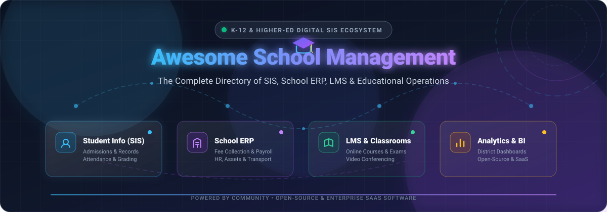
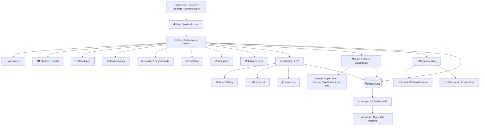
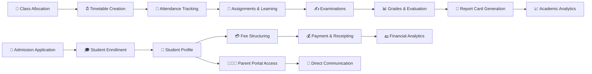

# 🏫 Awesome School Management & SIS Ecosystem 🚀

  

  
  
  
  
  
  

## 📌 Ecosystem Overview & Market Insights

A curated list of **SaaS/Hosted Platforms** and **Open-Source GitHub Projects** for **School Management Systems (SMS)**, **Student Information Systems (SIS)**, **School ERP**, and **Education Management Platforms**. These systems manage student records, admissions, attendance, examinations, grades, fees, timetables, communication, transportation, libraries, staff, parent portals, and broader school administration.

> **📊 Global Market Size & Sector Dynamics**: The global School Management Systems & SIS software market is estimated at **~$15.2 Billion in 2026** (projected to reach **~$28.4 Billion by 2032** at a ~11.5% CAGR). The sector is **moderately to highly fragmented**, characterized by prominent regional incumbents (e.g., PowerSchool and Blackbaud in North America; Teachmint & Fedena in South Asia/EMEA; Classter in Europe) and a vibrant ecosystem of specialized EdTech SaaS tools and self-hosted open-source software, rather than a single winner-take-all monopoly.

---

## 📑 Table of Contents

- [🏢 Commercial SaaS / Hosted Platforms](#-commercial-saas--hosted-platforms)
- [⭐ Open-Source GitHub Projects & Ecosystem](#-open-source-github-projects--ecosystem)
- [🏛️ Open-Source School Management & SIS Platforms](#%EF%B8%8F-open-source-school-management--sis-platforms)
- [🎓 Open-Source Student Information Systems (SIS)](#-open-source-student-information-systems-sis)
- [💼 Open-Source Education ERP & Business Frameworks](#-open-source-education-erp--business-frameworks)
- [📚 Open-Source LMS & Virtual Classrooms](#-open-source-lms--virtual-classrooms)
- [💬 Open-Source Communication & Collaboration](#-open-source-communication--collaboration)
- [📊 Open-Source Analytics & Reporting](#-open-source-analytics--reporting)
- [🔄 Commercial School Management → Open-Source Equivalents](#-commercial-school-management--open-source-equivalents)
- [🏗️ Frameworks for Building Custom School Management Systems](#%EF%B8%8F-frameworks-for-building-custom-school-management-systems)
- [📐 Reference School Management Architecture](#-reference-school-management-architecture)
- [🔄 Typical School Management Workflow](#-typical-school-management-workflow)
- [📊 Open-Source Capability Matrix](#-open-source-capability-matrix)
- [📈 Star History](#-star-history)
- [🤝 How to Contribute](#-how-to-contribute)
- [⚠️ Disclaimer](#%EF%B8%8F-disclaimer)

---

## 🏢 Commercial SaaS / Hosted Platforms

Below is a curated list of enterprise hosted platforms sorted descending by company size (valuation / revenue):

| SaaS Platform | Description | Pricing (Starting Tier) | Free Tier Limit | Company Size (Valuation / Revenue) |
| --- | --- | --- | --- | --- |
| **[PowerSchool](https://www.powerschool.com/)** | Large-scale K-12 education technology ecosystem covering SIS, learning, assessment, analytics, communication and school/district administration. | ~$5.00 to $6.00/student/year (minimum annual district contract of $6,000/year) | No free forever plan or self-serve free trial; live customized demonstration available upon request | ~$5.6 Billion Valuation (~$700M+ ARR) |
| **[Blackbaud Education Management](https://www.blackbaud.com/solutions/education-management)** | Education-management suite covering student information, enrollment, learning, advancement and school administration. | ~$21,000/year (or ~$15.00 to $25.00/student/year for independent schools) | No free forever plan or self-serve free trial; live customized software demonstration available upon request | ~$4.0 Billion Market Cap (~$1.1B Revenue) |
| **[Infinite Campus](https://www.infinitecampus.com/)** | K-12 SIS platform supporting student records, attendance, grades, scheduling, communication, analytics and district administration. | ~$10.00/student/year (minimum district annual contract of ~$6,000/year) | No free forever plan or self-serve free trial; live customized demonstration available upon request | ~$1.2 Billion Valuation (~$150M+ ARR) |
| **[Veracross](https://www.veracross.com/)** | Independent-school management platform combining SIS, admissions, advancement, billing, scheduling, communication and school operations. | $500/month (~$6,000/year base platform fee or ~$10.00 to $15.00/student/year) | No free forever plan or self-serve free trial; custom live demonstration available upon request | ~$1.0 Billion Valuation (~$100M+ ARR) |
| **[FACTS SIS](https://www.factsmgt.com/)** | School information-management platform covering student records, enrollment, academics, attendance, communication and administrative workflows. | ~$5.00 to $6.00/student/month (~$60/student/year) | No free forever plan or self-serve free trial; live customized demonstration available upon request | ~$800 Million Valuation (~$200M Revenue) |
| **[Teachmint](https://www.teachmint.com/)** | Education-management and digital-classroom platform providing school administration, learning, communication, assessment and teacher-focused tools. | ₹450/month (~$5.50/month) for basic software tier (or ₹1,20,000 unit cost for hardware/software bundle) | Free forever plan available for up to 100 students per classroom (with 100GB storage & 8 hrs live sessions/day fair-use limit) | ~$500 Million Valuation (~$15M+ ARR) |
| **[Finalsite](https://www.finalsite.com/)** | Education platform combining school websites, communications, enrollment and digital engagement. | ~$7,500/year (base annual software, CMS and hosting license fee) | No free forever plan or self-serve free trial; personalized live demonstration available upon request | ~$450 Million Valuation (~$60M Revenue) |
| **[Skyward](https://www.skyward.com/)** | K-12 student information and school-management ecosystem covering administration, academics, finance, HR and family engagement. | ~$5,000 to $30,000/year (or ~$8.00 to $12.00/student/year for school districts) | No free forever plan or self-serve free trial; live or recorded demonstration available upon request | ~$400 Million Valuation (~$100M Revenue) |
| **[Aeries](https://www.aeries.com/)** | K-12 student information system supporting enrollment, attendance, grading, scheduling, reporting, parent/student portals and analytics. | ~$5,000/year (or ~$10.00 to $40.00/student/year depending on district size) | No free forever plan or self-serve free trial; live customized demonstration available upon request | ~$200 Million Valuation (~$30M Revenue) |
| **[Classter](https://www.classter.com/)** | Comprehensive school and higher-education management platform combining SIS, LMS, admissions, finance, CRM, scheduling and communication. | ~€3.00 to €8.50/student/year (minimum ~$300/year base commitment) | No free forever plan or self-serve free trial; live online demo available upon request | ~$50 Million Valuation (~$5M ARR) |
| **[Fedena](https://fedena.com/)** | School ERP/SIS platform covering student management, academics, attendance, examinations, fees, communication, HR and administration. | $999/year (~₹40,000/year for standard plan) | 14-day free trial (full feature access, no credit card required); no free forever plan | ~$35 Million Valuation (~$4M ARR) |
| **[Gradelink](https://www.gradelink.com/)** | Cloud-based student information and school-management system covering enrollment, attendance, grading, report cards, communication and administration. | $117/month for small schools (up to 50 active students) | No free forever plan; offers a free trial/demo account preloaded with sample data for hands-on evaluation | ~$25 Million Valuation (~$5M ARR) |
| **[Alma SIS](https://www.getalma.com/)** | K-12 student information system providing student records, grading, attendance, scheduling, reporting, communication and family-facing functionality. | ~$5,000/year (or ~$4.00 to $7.00/student/year) | 30-day free trial (sandbox environment with sample data, no credit card required); no free forever plan | ~$20 Million Valuation (~$3M ARR) |
| **[QuickSchools](https://www.quickschools.com/)** | Cloud-based school management/SIS platform covering student records, attendance, gradebook, report cards, scheduling, communication and administration. | $0.99/student/month on Gaia Plan (minimum 30 students / $29.70 per month) | 30-day free trial (full feature access up to 300 test students, no credit card required); no free forever plan | ~$15 Million Valuation (~$2.5M ARR) |
| **[OpenEduCat](https://openeducat.org/)** | Education ERP with both community/self-hosted and commercial cloud offerings, covering admissions, students, attendance, examinations, fees, library, timetable and parent communication. | Cloud SaaS starting tier at $349/year (for 500-user pack) or $79/year per enterprise module | Free-forever Community Edition (LGPLv3, self-hosted); Cloud SaaS offers a 15-day free trial with full enterprise module access and no credit card required | ~$10 Million Valuation (~$1.5M ARR) |
| **[MyClassCampus](https://www.myclasscampus.com/)** | School ERP and campus-management platform with modules for students, attendance, fees, examinations, communication, transport and administration. | ₹30/student/month (~$0.36/student/month, minimum ₹25,000/year school subscription) | 14-day free trial (access to standard modules, no credit card required); no free forever plan | ~$8 Million Valuation (~$1M ARR) |

---

## ⭐ Open-Source GitHub Projects & Ecosystem

The open-source education management ecosystem spans core SIS, education ERPs, LMS platforms, video classroom applications, and analytics tools. Below are the top open-source repositories sorted descending by GitHub Star Count:

* 📊 **[Grafana](https://github.com/grafana/grafana)**  — Operational monitoring, attendance visualization, and school system dashboards.
* 📈 **[Apache Superset](https://github.com/apache/superset)**  — Enterprise data exploration and analytics platform for educational data lakes and district reporting.
* 📊 **[Metabase](https://github.com/metabase/metabase)**  — Easy-to-use business intelligence and analytics tool for school performance and attendance dashboards.
* 💬 **[Rocket.Chat](https://github.com/RocketChat/Rocket.Chat)**  — Self-hosted team messaging and communication platform for campus collaboration.
* 🦆 **[DuckDB](https://github.com/duckdb/duckdb)**  — High-performance analytical in-process SQL database engine for school dataset processing.
* 💼 **[ERPNext](https://github.com/frappe/erpnext)**  — Full-featured open-source ERP platform supporting school accounting, HR, inventory, payroll, and asset management.
* 💬 **[Mattermost](https://github.com/mattermost/mattermost)**  — Open-source collaboration and chat platform for faculty, staff, and administrative communication.
* ☁️ **[Nextcloud Server](https://github.com/nextcloud/server)**  — Self-hosted collaboration, document sharing, assignment file drop, and calendar system for schools.
* 📹 **[Jitsi Meet](https://github.com/jitsi/jitsi-meet)**  — Open-source video conferencing platform for virtual classrooms and online parent-teacher meetings.
* 🎥 **[BigBlueButton](https://github.com/bigbluebutton/bigbluebutton)**  — Open-source virtual classroom web conferencing system designed specifically for online learning.
* 🎓 **[Open edX Platform](https://github.com/openedx/edx-platform)**  — Scalable open-source learning platform powering digital learning environments worldwide.
* 📘 **[Moodle](https://github.com/moodle/moodle)**  — The world's most widely deployed open-source Learning Management System (LMS).
* 🎨 **[Canvas LMS](https://github.com/instructure/canvas-lms)**  — Open-source core of the Canvas Learning Management System by Instructure.
* 📖 **[Chamilo LMS](https://github.com/chamilo/chamilo-lms)**  — Lightweight learning management system focused on accessibility, ease of use, and course creation.
* 🏫 **[OpenEduCat ERP](https://github.com/openeducat/openeducat_erp)**  — Comprehensive open-source educational ERP built on Odoo, covering admissions, attendance, fees, exams, and timetables.
* 🎒 **[RosarioSIS](https://github.com/francoisjacquet/rosariosis)**  — Web-based student information system covering student records, attendance, grades, scheduling, and billing.
* 🐒 **[Gibbon Core](https://github.com/GibbonEdu/core)**  — Purpose-built open-source school management platform for teachers, students, parents, and leaders.
* 📖 **[Frappe Education](https://github.com/frappe/education)**  — Open-source education management app built on Frappe framework for student groups, programs, and assessments.
* 📚 **[Koha ILS](https://github.com/Koha-Community/Koha)**  — Full-featured open-source integrated library system (ILS) for school and campus libraries.
* 🛠️ **[Fedena](https://github.com/projectfedena/fedena)**  — Open-source Ruby on Rails school management application for campus administration and student records.

---

## 🏛️ Open-Source School Management & SIS Platforms

### 🏫 OpenEduCat
**[OpenEduCat](https://github.com/openeducat/openeducat_erp)**  is one of the strongest open-source candidates for a comprehensive school-management platform.
- **Key Modules**: Student Information, Faculty Management, Admissions, Courses, Attendance, Examinations, Fees, Library, Hostel, Timetable, Assignments, and Parent Communication.
- **License**: LGPLv3 (Community Edition). Built on the Odoo ERP framework.

### 🐒 Gibbon
**[Gibbon](https://github.com/GibbonEdu/core)**  is a purpose-built open-source school management system designed specifically for K-12 education.
- **Key Modules**: Students, Admissions, Attendance, Timetable, Markbook, Assessments, Behaviour, Staff, Activities, Library, Finance, and Administration.
- **License**: GPLv3. Active, community-driven PHP development.

### 🎒 RosarioSIS
**[RosarioSIS](https://github.com/francoisjacquet/rosariosis)**  is a lightweight web-based student information system emphasizing school administration.
- **Key Modules**: Student Records, Enrollment, Attendance, Gradebook, Scheduling, Discipline, Billing, and Moodle integration.
- **License**: GPLv2. Multi-language web application.

---

## 🔄 Commercial School Management → Open-Source Equivalents

| Commercial Platform | Primary Focus | Recommended Open-Source Alternative Stack 🛠️ |
| --- | --- | --- |
| **PowerSchool** | K-12 SIS + learning + analytics | Gibbon + RosarioSIS + Moodle + Metabase |
| **Blackbaud** | Independent school management & SIS | OpenEduCat + Moodle + ERPNext + Nextcloud |
| **Infinite Campus** | District SIS + analytics | RosarioSIS + Gibbon + OpenEduCat + Apache Superset |
| **Veracross** | Independent school SIS & operations | OpenEduCat + ERPNext + Moodle |
| **FACTS SIS** | SIS + school administration | RosarioSIS + Gibbon + OpenEduCat |
| **Teachmint** | School management + teaching + video | OpenEduCat + Moodle + Jitsi Meet |
| **Finalsite** | School websites & communications | Nextcloud + Mattermost + OpenEduCat |
| **Skyward** | K-12 SIS + administration | OpenEduCat + Gibbon + RosarioSIS |
| **Aeries** | K-12 SIS & parent portal | RosarioSIS + Gibbon + Frappe Education |
| **Classter** | SIS + LMS + ERP | OpenEduCat + Moodle + ERPNext |
| **Fedena** | School ERP/SIS | OpenEduCat + Gibbon + RosarioSIS |
| **Gradelink** | SIS + grading + attendance | RosarioSIS + Gibbon |
| **Alma SIS** | K-12 SIS & family portal | Gibbon + RosarioSIS |
| **QuickSchools** | Cloud SIS & gradebook | Gibbon + RosarioSIS |

---

## 🏗️ Frameworks for Building Custom School Management Systems

A comprehensive open-source school management architecture can be assembled using the following composable layers:

| Layer | Open-Source Technology Options 🛠️ |
| --- | --- |
| **Core SIS** | Gibbon · RosarioSIS · Frappe Education |
| **Education ERP** | OpenEduCat · ERPNext |
| **Finance / Accounting** | ERPNext · Odoo Community |
| **LMS / E-Learning** | Moodle · Open edX · Canvas LMS · Chamilo |
| **Virtual Classrooms** | BigBlueButton · Jitsi Meet |
| **Communication & Portals** | Nextcloud · Mattermost · Rocket.Chat |
| **Database Systems** | PostgreSQL · MariaDB · DuckDB |
| **Business Intelligence** | Metabase · Apache Superset · Grafana |
| **Identity & SSO** | Keycloak · Authentik |
| **API Gateway** | REST · GraphQL · Frappe API |
| **Container & Hosting** | Docker · Kubernetes |

---

## 📐 Reference School Management Architecture

---

## 🔄 Typical School Management Workflow

---

## 📊 Open-Source Capability Matrix

| Capability | Commercial Platforms | Open-Source Options 🛠️ |
| --- | ---: | --- |
| **Student Information** | ✓ | Gibbon · RosarioSIS · OpenEduCat |
| **Admissions & Enrollment** | ✓ | OpenEduCat · Gibbon · RosarioSIS |
| **Attendance & Timetable** | ✓ | Gibbon · RosarioSIS · OpenEduCat |
| **Gradebook & Report Cards** | ✓ | Gibbon · RosarioSIS · Moodle |
| **Fee Management** | ✓ | OpenEduCat · ERPNext · RosarioSIS |
| **Library Management** | ✓ | Koha · OpenEduCat · Gibbon |
| **HR & Payroll** | ✓ | ERPNext · Odoo Community |
| **LMS / Virtual Classroom** | ✓ | Moodle · Canvas LMS · BigBlueButton · Jitsi |
| **Parent & Student Portals** | ✓ | OpenEduCat · Gibbon · RosarioSIS |
| **Analytics & BI** | ✓ | Metabase · Apache Superset · Grafana |
| **Self-Hosting & Data Control** | Limited | ✓ |

---

## 📈 Star History

---

## 🤝 How to Contribute

Contributions are welcome! Please follow these simple steps:

1. 🍴 Fork the repository.
2. 📝 Add or update entries in `README.md` following the existing tabular or badged list format.
3. 🔗 Ensure all links lead to official sites or valid GitHub stargazers pages.
4. 🚀 Submit a Pull Request (PR) with a brief description of your additions.

Check out [Awesome List Collection](https://github.com/ishandutta2007/Awesome-Awesome-Awesome) for more awesome resources! ⭐

---

## ⚠️ Disclaimer

* This is a **community-curated** list provided for informational and educational purposes.
* Commercial products and trademarks belong to their respective corporate owners.
* Open-source projects listed here are not necessarily feature-for-feature replacements for commercial school management platforms.
* Licensing and repository maintenance status can change over time; always verify before production deployment.
